# Data Quality Validation System

**Last Updated:** January 6, 2026  
**Status:** ✅ Working  
**Files:** `automation/f12_collect_and_import.py`, `src/components/EventsDashboard.js`

---

## Overview

The Data Quality Validation system automatically detects errors and issues in event data by comparing structured API data against description text. This catches copy/paste errors, outdated descriptions, and missing content.

## How It Works

When events are synced from iClassPro, the system:
1. Extracts **structured data** (date, time, age, event type) from the API
2. Parses the **title AND description text** for the same information
3. **Compares all three sources** to detect mismatches
4. **Flags issues** with appropriate icons on the calendar

## Complete Validation Matrix

### Completeness Checks (Does it EXIST?)

| Required Field | In Title? | In Description? |
|----------------|-----------|-----------------|
| **Age** | ✅ Must exist | ✅ Must exist |
| **Date** | ✅ Must exist | ✅ Must exist (or time) |
| **Time** | Optional | ✅ Should exist |
| **Price** | Optional | ✅ Must exist |
| **Skill (clinics)** | Optional | ℹ️ Should exist |

### Accuracy Checks (Does it MATCH?)

| Check | iClass Data | vs Title | vs Description | Title vs Desc |
|-------|-------------|----------|----------------|---------------|
| **Date/Month** | `startDate` | - | ✅ | - |
| **Year** | `startDate` | ✅ | - | - |
| **Time** | `time` | ✅ | ✅ | - |
| **Min Age** | `age_min` | ✅ | ✅ | ✅ |
| **Program Type** | `type` | ✅ | ✅ | ✅ |
| **Skill (clinics)** | - | - | - | ✅ |
| **Price** | (not in API) | - | Must exist | ✅ |
| **Day of Week** | `day_of_week` | - | ✅ | - |

## Validation Icons

| Icon | Meaning | Severity |
|------|---------|----------|
| 🚨 | Mismatch error (wrong skill, wrong program type) | Error |
| ⚠️ | Warning (flyer only, minor issues) | Warning |
| ❌ | No description at all | Error |
| 🖼️ | Has flyer image (informational only) | Info |

## What Gets Validated

### Programs Validated
- ✅ **KIDS NIGHT OUT (KNO)**
- ✅ **CLINIC**
- ✅ **OPEN GYM**
- ⏸️ **CAMP** - Skipped (too complex, many false positives)

### Validation Checks

## PART A: COMPLETENESS CHECKS (Does it EXIST?)

These checks verify that REQUIRED fields are present, not just accurate.

#### C1. Title Must Have Age
Checks if title contains age information in any format.

**Formats Recognized:** `Ages 5+`, `Ages 5-12`, `Age 5+`, `Students 5+`, `5+`, `5-12`

**Example Violation:**
- Title: "Gym Fun Fridays | January 16 | 10:00-11:30am | $10"
- ⚠️ Flag: "Title missing age (e.g., 'Ages 5+')"

#### C2. Title Must Have Date
Checks if title contains date information.

**Formats Recognized:** `January`, `Jan`, `1/9`, `01/09`, `9th`

**Example Violation:**
- Title: "Kids Night Out Bring a Friend for $10 - Friends sign up here!"
- ⚠️ Flag: "Title missing date (e.g., 'January 9th')"

#### C3. Description Must Have Age
Checks if description contains age information.

**Example Violation:**
- Description: "KIDS NIGHT OUT extended!!! 7-10 PM. Take the night off..."
- ⚠️ Flag: "Description missing age"

#### C4. Description Must Have Date/Time
Checks if description contains date or time information.

**Example Violation:**
- Description: "This hands-on open gym invites toddlers to move, explore, jump, and play!"
- ⚠️ Flag: "Description missing date/time"

#### C5. Clinic Should Mention Skill (INFO level)
For CLINIC events, checks if description mentions a specific gymnastics skill.

**Skills Recognized:** cartwheel, back handspring, handstand, tumbling, bars, pullover, beam, vault, floor, trampoline, bridge, kickover, walkover, ninja, cheer

**Example Info:**
- Description: "Our specialized skill clinics provide students with the opportunity..."
- ℹ️ Info: "Clinic description doesn't mention specific skill"

---

## PART B: ACCURACY CHECKS (Does it MATCH?)

These checks verify that values are CONSISTENT across iClass, Title, and Description.

#### 1. Date/Month Validation (All 3 Programs)
Compares structured `startDate` to month mentioned in description.

**Example Error:**
- Event date: January 24
- Description says: "December 27th"
- 🚨 Flag: "Event is January 24 but description says 'December'"

#### 1b. Year Validation - TITLE (All 3 Programs)
Checks if the title contains a wrong year (catches copy/paste from previous year).

**Example Error:**
- Event date: 2026-01-17
- Title says: "Clinic | Ages 5+ | 01/17/**2025**"
- 🚨 Flag: "Title says 2025 but event is in 2026"

#### 2. Time Validation (All 3 Programs)
Compares structured `time` to times in **BOTH title AND description**. **Exact hour match required.**

**Formats Recognized:** `5:00pm`, `5:00 pm`, `5pm`, `5 pm`, `5:00 p.m.`, etc.

**Checks Performed:**
| Check | Source | Comparison |
|-------|--------|------------|
| 1 | iClass `time` | vs Title time |
| 2 | iClass `time` | vs Description time |

**Example Error:**
- Event time: 2:00 PM - 3:00 PM
- Description says: "2:30pm-3:30pm"
- ⚠️ Flag: "iClass time is 2:00 PM - 3:00 PM but description says 2:30 pm"

**What DOESN'T Flag:**
- Event: 6:30 PM, Desc: "6pm" ✅ (same hour)
- Event: 6:30 PM, Desc: "6:30pm" ✅ (exact match)

#### 3. Age Validation - MIN Age Only (All 3 Programs)
Compares MIN age across **three sources**: iClass system, Title, and Description. **All three must match.**

**Note:** MAX age is NOT checked because managers often omit it or use "+" notation (e.g., "Ages 5+").

**Formats Recognized:** `Ages 5-12`, `Ages 5+`, `Age 5`, `5-12 years`

**Three Comparisons Made:**

| Check | What's Compared | Example Error |
|-------|-----------------|---------------|
| 1 | iClass `age_min` vs Title | "iClass min age is 7 but title says 5" |
| 2 | iClass `age_min` vs Description | "iClass min age is 7 but description says 5" |
| 3 | Title vs Description | "Title says age 5 but description says 7" |

**All Mismatch Scenarios:**

| iClass | Title | Desc | Result |
|--------|-------|------|--------|
| 5 | 5 | 5 | ✅ OK - all match |
| 7 | 5 | 5 | ⚠️ Flag: iClass≠Title, iClass≠Desc |
| 5 | 5 | 7 | ⚠️ Flag: iClass≠Desc, Title≠Desc |
| 5 | 7 | 7 | ⚠️ Flag: iClass≠Title, iClass≠Desc |
| 5 | 7 | 5 | ⚠️ Flag: iClass≠Title, Title≠Desc |

**What DOESN'T Flag:**
- Event: 5-12, Desc: "Ages 5+" ✅ (min age matches)
- Event: 5-12, Desc: "Ages 5-17" ✅ (min age matches, max ignored)

#### 4. Program Type Validation

Checks program type across **three sources**: iClass `type`, Title keywords, and Description keywords.

**4a. iClass Type vs Title (NEW):**

| iClass Type | Title Contains | Flag? |
|-------------|----------------|-------|
| KIDS NIGHT OUT | "Clinic" | 🚨 iClass=KNO but Title says Clinic |
| KIDS NIGHT OUT | "Open Gym" | 🚨 iClass=KNO but Title says Open Gym |
| CLINIC | "Kids Night Out" or "KNO" | 🚨 iClass=CLINIC but Title says KNO |
| CLINIC | "Open Gym" (no clinic) | 🚨 iClass=CLINIC but Title says Open Gym |
| OPEN GYM | "Kids Night Out" or "KNO" | 🚨 iClass=OPEN GYM but Title says KNO |
| OPEN GYM | "Clinic" (no open gym) | 🚨 iClass=OPEN GYM but Title says Clinic |

**4b. iClass Type vs Description:**

**KIDS NIGHT OUT:**
- ✅ Must contain: "Kids Night Out" or "KNO" in description
- 🚨 Flag if: Description says "Clinic"
- ✅ Ignores "open gym" - KNO often lists activities like "open gym, ninja, dance" as rotations

**CLINIC:**
- ✅ Must contain: "Clinic" in description
- 🚨 Flag if: Description says "Kids Night Out" or starts with "Open Gym"
- 🚨 Flag if: Different skill than title (see Skill Mismatch below)

**OPEN GYM:**
- ✅ Must contain one of: "Open Gym", "Fun Gym", "Gym Fun", "Preschool Fun", "play and explore the gym", or "open to all"
- 🚨 Flag if: Description says "Clinic" or "Kids Night Out"

**Note:** Some gyms call Open Gym by different names (e.g., "Gym Fun Fridays", "Preschool Fun Gym"). The validation handles these variations.

#### 5. Title vs Description Cross-Check (ALL Events)
Catches copy/paste errors where title and description contradict each other. **Applies to ALL events regardless of which iClassPro page they're on.**

| Title Says | Description Says | Result |
|------------|------------------|--------|
| Clinic | Kids Night Out | 🚨 Error |
| Kids Night Out / KNO | Clinic | 🚨 Error |
| Open Gym / Gym Fun | Kids Night Out | 🚨 Error |
| Kids Night Out / KNO | Open Gym (at start) | 🚨 Error |
| Clinic | Open Gym (at start) | 🚨 Error |
| Open Gym / Gym Fun | Clinic | 🚨 Error |

**Why This Matters:** Even if the event is on the correct iClassPro page, someone might have pasted the wrong description template.

#### 6. Skill Mismatch (CLINIC Only)
Compares skill word in title vs description.

**Example Error:**
- Title: "Back Handspring Clinic"
- Description: "Cartwheel Clinic at Rowland Ballard..."
- 🚨 Flag: "Title says 'back handspring' but description says 'cartwheel'"

**Skills Checked:**
- cartwheel, back handspring, backhandspring, handstand, tumbling
- bars, pullover, pullovers, front flip, roundoff, backbend
- ninja, cheer, beam, vault, floor

#### 7. Price Validation (All Programs except CAMP)
Checks that price is present in description and matches title if present in both.

**Validation Flow:**

```mermaid
flowchart TD
    A[Check Event] --> B{Has Description Text?}
    B -->|No| C["❌ No description"]
    B -->|Yes| D{Has $ in Description?}
    D -->|No| E["❌ No price in description"]
    D -->|Yes| F{Has $ in Title?}
    F -->|No| G["✅ OK - price in desc is enough"]
    F -->|Yes| H{Title $XX = Description $XX?}
    H -->|Yes| I["✅ OK - prices match"]
    H -->|No| J["❌ Price mismatch"]
```


| Condition | Icon | Validation Error Type |
|-----------|------|----------------------|
| No description at all | ❌ | (existing - `description_status = 'none'`) |
| No $ in description | ❌ | `missing_price_in_description` |
| Price in title ≠ description | ❌ | `price_mismatch` |
| Price in description only | ✅ | (no error) |
| Price matches in both | ✅ | (no error) |

**Price Pattern:** `$XX` or `$XX.XX` (e.g., $35, $69.00)

**Example Errors:**
- Description has text but no `$XX` anywhere
  - ❌ Flag: "Price not found in description"
- Title: "Kids Night Out | $35" / Description: "...$40 per child..."
  - ❌ Flag: "Title says $35 but description says $40"

**Why CAMP is skipped:** Camp pricing is complex (varies by day, week, half-day vs full-day). Price validation for camps will be added later with confirmed pricing data.

#### 8. Flyer Detection (All Programs)
Detects `` tags in description HTML.

- 🖼️ `has_flyer = true` - Event has a flyer image
- `flyer_url` - URL to the image (displayed in event details panel)
- ⚠️ `description_status = 'flyer_only'` - Has image but NO text

#### 9. Availability & Registration (All Programs)
Tracks event availability from iClassPro:

- ℹ️ `sold_out` - Event has no openings (displayed as "FULL" badge)
- ⚠️ `registration_closed` - Registration ended but event hasn't happened yet
- ℹ️ `registration_not_open` - Registration hasn't started yet

## Database Fields

```sql
-- Validation columns in events table
has_flyer               BOOLEAN DEFAULT false
flyer_url               TEXT
description_status      TEXT DEFAULT 'unknown'  -- 'full', 'flyer_only', 'none', 'unknown'
validation_errors       JSONB DEFAULT '[]'::jsonb
acknowledged_errors     JSONB DEFAULT '[]'::jsonb  -- Dismissed warnings

-- Availability columns (from iClassPro)
has_openings            BOOLEAN DEFAULT true
registration_start_date TEXT
registration_end_date   TEXT
```

## Real Errors Caught

This system has caught real copy/paste errors:

| Gym | Issue | Details |
|-----|-------|---------|
| RBK | Wrong skill | "Back Handspring Clinic" with "Cartwheel Clinic" description |
| RBK | Wrong skill | "Cheer Prep Clinic" with "Cartwheel Clinic" description |
| RBA | Wrong date | "January 24" clinic with "December 27th" in description |
| RBA | Wrong program | "Open Gym" event with "Clinic" description |
| HGA | Wrong date | "January 16" event with "December 19" in description |

## How to Clear Validation Data

To reset all validation and re-sync fresh:

```sql
UPDATE events 
SET 
  validation_errors = '[]'::jsonb,
  description_status = 'unknown',
  has_flyer = false,
  flyer_url = NULL;
```

Then re-sync gyms: **🪄 Admin → Open Automated Sync**

## Why CAMP is Skipped

Camp descriptions are complex:
- Mention multiple activities ("open gym", "ninja", "gymnastics")
- Describe schedules across multiple weeks
- Use generic templates that apply to many camps

This caused too many false positives, so CAMPs only get:
- ❌ Flag if NO description at all
- ⚠️ Flag if flyer only (no text)

## Technical Implementation

### Files Involved
- `automation/f12_collect_and_import.py` - Validation logic runs during sync
- `automation/local_api_server.py` - ALLOWED_EVENT_FIELDS includes validation fields
- `src/lib/eventComparison.js` - Comparison includes validation fields
- `src/components/EventsDashboard/SyncModal.js` - Update logic saves validation fields
- `src/components/EventsDashboard.js` - Displays icons on calendar

### Validation Flow
```
iClassPro API 
    ↓
Railway (f12_collect_and_import.py)
    ↓ extracts structured data
    ↓ parses description text
    ↓ compares and generates validation_errors
    ↓
Supabase (stores validation fields)
    ↓
Frontend (displays icons)
```

## Dismissing Validation Warnings

Sometimes a validation warning is a **false positive** - the data is actually correct but the system flagged it anyway. You can dismiss these warnings.

### How to Dismiss a Warning

1. Click on the event in the calendar
2. In the Event Details panel, you'll see the warning with a **[✓ OK]** button
3. Click **[✓ OK]** to dismiss that specific warning
4. The warning won't reappear for that event

### What Happens When You Dismiss

- The error message is saved to `acknowledged_errors` in the database
- The 🚨 icon disappears from the calendar
- The stats no longer count it as an error
- **Change detection still works** - if the event is modified in iClassPro, the sync will still detect it

### If the Event is Updated Later

| Scenario | What Happens |
|----------|--------------|
| Same issue exists | Warning stays dismissed (same message) |
| Issue is fixed | No warning at all (great!) |
| New/different issue | New warning appears (different message) |

### Undoing a Dismissal

If you dismissed something by mistake:
1. Click on the event
2. Look for "✓ X warning(s) verified & dismissed"
3. Click **"Undo all"** to restore the warnings

---

## Changelog

| Date | Change |
|------|--------|
| Jan 6, 2026 | **NEW** COMPLETENESS CHECKS - Title must have age, Title must have date |
| Jan 6, 2026 | **NEW** COMPLETENESS CHECKS - Description must have age, Description must have date/time |
| Jan 6, 2026 | **NEW** COMPLETENESS CHECKS - Clinic should mention skill (INFO level) |
| Jan 6, 2026 | **NEW** Year validation in title - catches "01/17/2025" when event is 2026 |
| Jan 6, 2026 | **NEW** Time validation now checks BOTH title AND description vs iClass time |
| Jan 6, 2026 | **NEW** Program type now checks iClass type vs Title keywords (not just description) |
| Jan 6, 2026 | **ENHANCED** Age validation now checks all 3: iClass vs Title, iClass vs Desc, Title vs Desc |
| Jan 5, 2026 | **NEW** Title-vs-Description cross-check - catches Clinic/KNO/OpenGym mismatches in title vs desc |
| Jan 5, 2026 | **FIXED** Time validation now handles all formats: 5:00pm, 5pm, 5:00 PM, 5 pm |
| Jan 5, 2026 | **FIXED** Age validation now only checks MIN age (max age removed - often omitted by managers) |
| Jan 5, 2026 | **FIXED** Time/Age validation now requires EXACT match (removed wrong ±1 hour / ±2 year tolerances) |
| Jan 5, 2026 | Added pricing validation - checks price in description & title/desc match |
| Dec 28, 2025 | Documentation update - added availability fields, updated access paths |
| Dec 18, 2025 | Added validation warning dismiss feature (✓ OK button, Undo all) |
| Dec 9, 2025 | Initial implementation - date, time, age, program type validation |
| Dec 9, 2025 | Added skill mismatch detection for CLINIC |
| Dec 9, 2025 | Added flyer detection and display |
| Dec 9, 2025 | CAMP validation skipped to avoid false positives |
| Dec 9, 2025 | Added Open Gym variations (Gym Fun, Preschool Fun, etc.) |


