# Data Quality Validation System

**Last Updated:** February 5, 2026  
**Status:** ✅ Fully Deployed  
**Files:** `automation/f12_collect_and_import.py`, `src/components/EventsDashboard.js`, `src/components/EventsDashboard/DismissRuleModal.js`, `src/components/AdminDashboard/AdminAuditReview.js`

---

## Overview

The Data Quality Validation system automatically detects errors and issues in event data by comparing structured API data against description text. This catches copy/paste errors, outdated descriptions, and missing content.

---

## ⭐ SOURCE OF TRUTH - CRITICAL REFERENCE ⭐

This section defines EXACTLY what data is considered "correct" and what gets compared against it.

### Where Data Comes From

| Data Type | Source of Truth | Where It Comes From |
|-----------|-----------------|---------------------|
| **Date** | iClass API `startDate` field | The date managers set when creating the event in iClass |
| **Year** | iClass API `startDate` field | Extracted from the date above |
| **Day of Week** | Calculated from `startDate` | Code calculates "Saturday" from "2026-02-15" |
| **Time** | iClass API `schedule.startTime` / `endTime` | The time fields managers set in iClass |
| **Age** | iClass API `minAge` / `maxAge` | The age restriction fields managers set in iClass |
| **Program Type** | iClass API `link_type_id` | Which section the event is listed under (camps, skill_clinics, kids_night_out, open_gym) |
| **Price (CAMP)** | ✅ Supabase `camp_pricing` table | YOUR manually-maintained pricing table per gym |
| **Price (CLINIC, KNO, OPEN GYM)** | ✅ Supabase `event_pricing` table | Prices per gym with `effective_date`/`end_date` support |

### Price Source of Truth by Event Type

| Event Type | Price Source of Truth | What Gets Compared |
|------------|----------------------|-------------------|
| **CAMP** | ✅ `camp_pricing` table (full_day_daily, full_day_weekly, half_day_daily, half_day_weekly) + `gym_valid_values` exceptions | Description price vs your Supabase pricing table |
| **CLINIC** | ✅ `event_pricing` table (per gym, with effective_date) | Description/title price vs your Supabase pricing table |
| **KIDS NIGHT OUT** | ✅ `event_pricing` table (per gym, with effective_date) | Description/title price vs your Supabase pricing table |
| **OPEN GYM** | ✅ `event_pricing` table (per gym, with effective_date) | Description/title price vs your Supabase pricing table |

### What Gets Compared to What

```
┌─────────────────────────────────────────────────────────────────────┐
│                        iClass API Fields                            │
│  (startDate, schedule.startTime, minAge, maxAge, link_type_id)      │
│                    = THE SOURCE OF TRUTH                            │
└─────────────────────────────────────────────────────────────────────┘
                              ↓ compared to ↓
┌─────────────────────────────────────────────────────────────────────┐
│                         EVENT TITLE                                 │
│  (Manager-written text: "Tumbling Clinic Ages 5-12 Feb 15 $45")     │
└─────────────────────────────────────────────────────────────────────┘
                              ↓ compared to ↓
┌─────────────────────────────────────────────────────────────────────┐
│                       EVENT DESCRIPTION                             │
│  (Manager-written text: "Join us for tumbling! $45, ages 5+...")    │
└─────────────────────────────────────────────────────────────────────┘
                              ↓ compared to ↓
┌─────────────────────────────────────────────────────────────────────┐
│                  SUPABASE PRICING TABLES                             │
│  camp_pricing: full_day_daily, full_day_weekly, etc. (CAMP)         │
│  event_pricing: per gym/type with effective_date (CLINIC/KNO/OG)    │
│  gym_valid_values: custom exceptions (Before Care $20, etc.)        │
└─────────────────────────────────────────────────────────────────────┘
```

### Description Status & Validation Behavior

| Scenario | `description_status` | What Happens |
|----------|---------------------|--------------|
| **No description AND no flyer** | `none` | ❌ Flagged as error. NO other validations run (nothing to compare). |
| **Flyer image only, no text** | `flyer_only` | ⚠️ Flagged as warning. NO other validations run (can't read images). |
| **Has text description** | `full` | ✅ ALL validations run (date, time, age, price, program type comparisons). |

**Important:** If an event only has a flyer image with no text, the system CANNOT validate anything because there's no text to compare against the iClass fields.

---

## Current Validation Stats (Full Year 2026)

| Check | Count | Severity |
|-------|-------|----------|
| Missing time in description | 249 | Warning |
| Missing age in description | 89 | Warning |
| Missing price in description | 62 | Error |
| Missing date/time in description | 55 | Warning |
| Day mismatch | 50 | Warning |
| Time mismatch | 47 | Warning |
| Missing age in title | 24 | Warning |
| Missing program in description | 21 | Warning |
| Age mismatch | 13 | Warning |
| Year mismatch (2025 vs 2026) | 13 | Error |
| Date mismatch | 7 | Error |
| Title/description program mismatch | 2 | Error |
| Program type mismatch | 2 | Warning |
| Missing program in title | 1 | Warning |
| Skill mismatch | 1 | Error |
| Missing date in title | 1 | Warning |

## How It Works

When events are synced from iClassPro, the system:
1. Extracts **structured data** (date, time, age, event type) from the API
2. Parses the **title AND description text** for the same information
3. **Compares all three sources** to detect mismatches
4. **Flags issues** with appropriate icons on the calendar

## Complete Validation Matrix

### Completeness Checks (Does it EXIST?)

| Required Field | In Title? | In Description? |
|----------------|-----------|-----------------|
| **Age** | ✅ Must exist | ✅ Must exist |
| **Date** | ✅ Must exist | ✅ Must exist (or time) |
| **Time** | Optional | ✅ Should exist |
| **Price** | Optional | ✅ Must exist |
| **Skill (clinics)** | Optional | ℹ️ Should exist |

### Accuracy Checks (Does it MATCH?)

| Check | iClass Data | vs Title | vs Description | Title vs Desc |
|-------|-------------|----------|----------------|---------------|
| **Date/Month** | `startDate` | - | ✅ | - |
| **Year** | `startDate` | ✅ | - | - |
| **Time** | `time` | ✅ | ✅ | - |
| **Min Age** | `age_min` | ✅ | ✅ | ✅ |
| **Program Type** | `type` | ✅ | ✅ | ✅ |
| **Skill (clinics)** | - | - | - | ✅ |
| **Price** | (not in API) | - | Must exist | ✅ |
| **Day of Week** | `day_of_week` | - | ✅ | - |

## Validation Icons

| Icon | Meaning | Severity |
|------|---------|----------|
| 🚨 | Mismatch error (wrong skill, wrong program type) | Error |
| ⚠️ | Warning (flyer only, minor issues) | Warning |
| ❌ | No description at all | Error |
| 🖼️ | Has flyer image (informational only) | Info |

## What Gets Validated

### Programs Validated
- ✅ **KIDS NIGHT OUT (KNO)**
- ✅ **CLINIC**
- ✅ **OPEN GYM**
- ✅ **CAMP** - Now validated (completeness and accuracy checks enabled Jan 6, 2026)

### Validation Checks

## PART A: COMPLETENESS CHECKS (Does it EXIST?)

These checks verify that REQUIRED fields are present, not just accurate.

#### C1. Title Must Have Age
Checks if title contains age information in any format.

**Formats Recognized:** `Ages 5+`, `Ages 5-12`, `Age 5+`, `Students 5+`, `5+`, `5-12`

**Example Violation:**
- Title: "Gym Fun Fridays | January 16 | 10:00-11:30am | $10"
- ⚠️ Flag: "Title missing age (e.g., 'Ages 5+')"

#### C2. Title Must Have Date
Checks if title contains date information.

**Formats Recognized:** `January`, `Jan`, `1/9`, `01/09`, `9th`

**Example Violation:**
- Title: "Kids Night Out Bring a Friend for $10 - Friends sign up here!"
- ⚠️ Flag: "Title missing date (e.g., 'January 9th')"

#### C3. Description Must Have Age
Checks if description contains age information.

**Example Violation:**
- Description: "KIDS NIGHT OUT extended!!! 7-10 PM. Take the night off..."
- ⚠️ Flag: "Description missing age"

#### C4. Description Must Have Date/Time
Checks if description contains date or time information.

**Example Violation:**
- Description: "This hands-on open gym invites toddlers to move, explore, jump, and play!"
- ⚠️ Flag: "Description missing date/time"

#### C5. Clinic Should Mention Skill (INFO level)
For CLINIC events, checks if **title OR description** mentions a specific gymnastics skill.

**Skills Recognized:** cartwheel, back handspring, backhandspring, handstand, tumbling, bars, pullover, pullovers, front flip, roundoff, backbend, ninja, cheer, beam, vault, floor, trampoline, tumbl, bridge, kickover, walkover, flip flop, flip-flop, back walkover, front walkover

**Example Info:**
- Description: "Our specialized skill clinics provide students with the opportunity..."
- ℹ️ Info: "Clinic description doesn't mention specific skill"

#### C6. Title Must Have Program Type Keyword
Checks if title contains the expected program type keyword based on iClassPro category.

**Program Keywords Recognized:**
| iClass Type | Recognized in Title |
|-------------|---------------------|
| OPEN GYM | "open gym", "gym fun", "fun gym", "preschool fun" |
| KIDS NIGHT OUT | "kids night out", "kid's night out", "kno", "night out" |
| CLINIC | "clinic" |
| CAMP | "camp", "day camp", "summer camp", "school year camp" |

**Example Violation:**
- iClass Type: CAMP
- Title: "Spring Break | March 16th-March 20th | Full Day (9-3)"
- ⚠️ Flag: "Title missing program type (e.g., 'Camp')"

#### C7. Description Must Have Program Type Keyword
Checks if description contains the expected program type keyword based on iClassPro category.

**Example Violation:**
- iClass Type: CLINIC
- Description: "Ninja training with obstacle courses..."
- ⚠️ Flag: "Description missing program type (should mention 'Clinic' or similar)"

---

## PART B: ACCURACY CHECKS (Does it MATCH?)

These checks verify that values are CONSISTENT across iClass, Title, and Description.

#### 1. Date/Month Validation (All 3 Programs)
Compares structured `startDate` to month mentioned in description.

**Example Error:**
- Event date: January 24
- Description says: "December 27th"
- 🚨 Flag: "Event is January 24 but description says 'December'"

#### 1b. Year Validation - TITLE (All 3 Programs)
Checks if the title contains a wrong year (catches copy/paste from previous year).

**Example Error:**
- Event date: 2026-01-17
- Title says: "Clinic | Ages 5+ | 01/17/**2025**"
- 🚨 Flag: "Title says 2025 but event is in 2026"

#### 2. Time Validation (All Programs)
Compares structured `time` to times in **BOTH title AND description**. Uses **hour-level comparison with format tolerance**.

**Formats Recognized (all treated equivalently):**
- `5:00pm`, `5:00 pm`, `5pm`, `5 pm`, `5:00 p.m.`
- `6:30p`, `6:30 PM`, `6:30pm` (TIGAR format)
- `9-3`, `9:00 - 3:00` (time ranges)
- `9:00 AM - 3:00 PM` (full format)

**Checks Performed:**
| Check | Source | Comparison |
|-------|--------|------------|
| 1 | iClass `time` | vs Title time |
| 2 | iClass `time` | vs Description time |

**Example Error:**
- Event time: 9:00 AM - 3:00 PM
- Description says: "8:30 am"
- ⚠️ Flag: "iClass time is 9:00 AM - 3:00 PM but description says 8:30 am"

**What DOESN'T Flag (format tolerance):**
- Event: 6:30 PM, Title: "6:30p" ✅ (same time, different format)
- Event: 6:30 PM, Desc: "6:30pm" ✅ (exact match)
- Event: 9:00 AM - 3:00 PM, Title: "9:00a - 3:00p" ✅ (same times)

#### 3. Age Validation - MIN Age Only (All 3 Programs)
Compares MIN age across **three sources**: iClass system, Title, and Description. **All three must match.**

**Note:** MAX age is NOT checked because managers often omit it or use "+" notation (e.g., "Ages 5+").

**Formats Recognized:** `Ages 5-12`, `Ages 5+`, `Age 5`, `5-12 years`

**Three Comparisons Made:**

| Check | What's Compared | Example Error |
|-------|-----------------|---------------|
| 1 | iClass `age_min` vs Title | "iClass min age is 7 but title says 5" |
| 2 | iClass `age_min` vs Description | "iClass min age is 7 but description says 5" |
| 3 | Title vs Description | "Title says age 5 but description says 7" |

**All Mismatch Scenarios:**

| iClass | Title | Desc | Result |
|--------|-------|------|--------|
| 5 | 5 | 5 | ✅ OK - all match |
| 7 | 5 | 5 | ⚠️ Flag: iClass≠Title, iClass≠Desc |
| 5 | 5 | 7 | ⚠️ Flag: iClass≠Desc, Title≠Desc |
| 5 | 7 | 7 | ⚠️ Flag: iClass≠Title, iClass≠Desc |
| 5 | 7 | 5 | ⚠️ Flag: iClass≠Title, Title≠Desc |

**What DOESN'T Flag:**
- Event: 5-12, Desc: "Ages 5+" ✅ (min age matches)
- Event: 5-12, Desc: "Ages 5-17" ✅ (min age matches, max ignored)

#### 4. Program Type Validation

Checks program type across **three sources**: iClass `type`, Title keywords, and Description keywords.

**4a. iClass Type vs Title (NEW):**

| iClass Type | Title Contains | Flag? |
|-------------|----------------|-------|
| KIDS NIGHT OUT | "Clinic" | 🚨 iClass=KNO but Title says Clinic |
| KIDS NIGHT OUT | "Open Gym" | 🚨 iClass=KNO but Title says Open Gym |
| CLINIC | "Kids Night Out" or "KNO" | 🚨 iClass=CLINIC but Title says KNO |
| CLINIC | "Open Gym" (no clinic) | 🚨 iClass=CLINIC but Title says Open Gym |
| OPEN GYM | "Kids Night Out" or "KNO" | 🚨 iClass=OPEN GYM but Title says KNO |
| OPEN GYM | "Clinic" (no open gym) | 🚨 iClass=OPEN GYM but Title says Clinic |

**4b. iClass Type vs Description:**

**KIDS NIGHT OUT:**
- ✅ Must contain: "Kids Night Out" or "KNO" in description
- 🚨 Flag if: Description says "Clinic"
- ✅ Ignores "open gym" - KNO often lists activities like "open gym, ninja, dance" as rotations

**CLINIC:**
- ✅ Must contain: "Clinic" in description
- 🚨 Flag if: Description says "Kids Night Out" or starts with "Open Gym"
- 🚨 Flag if: Different skill than title (see Skill Mismatch below)

**OPEN GYM:**
- ✅ Must contain one of: "Open Gym", "Fun Gym", "Gym Fun", "Preschool Fun", "play and explore the gym", or "open to all"
- 🚨 Flag if: Description says "Clinic" or "Kids Night Out"

**Note:** Some gyms call Open Gym by different names (e.g., "Gym Fun Fridays", "Preschool Fun Gym"). The validation handles these variations.

#### 5. Title vs Description Cross-Check (ALL Events)
Catches copy/paste errors where title and description contradict each other. **Applies to ALL events regardless of which iClassPro page they're on.**

| Title Says | Description Says | Result |
|------------|------------------|--------|
| Clinic | Kids Night Out | 🚨 Error |
| Kids Night Out / KNO | Clinic | 🚨 Error |
| Open Gym / Gym Fun | Kids Night Out | 🚨 Error |
| Kids Night Out / KNO | Open Gym (at start) | 🚨 Error |
| Clinic | Open Gym (at start) | 🚨 Error |
| Open Gym / Gym Fun | Clinic | 🚨 Error |

**Why This Matters:** Even if the event is on the correct iClassPro page, someone might have pasted the wrong description template.

#### 6. Skill Mismatch (CLINIC Only)
Compares skill word in **title vs description**. Checks if title mentions a skill and description mentions a DIFFERENT skill.

**Example Error:**
- Title: "Flip-Flop Clinic: January 16th: 6:30-8:00pm ($25)"
- Description: "Back Handspring Clinic at..."
- 🚨 Flag: "Title says 'flip-flop' but description says 'back handspring'"

**Skills Checked (comprehensive list):**
- cartwheel, back handspring, backhandspring, handstand, tumbling
- bars, pullover, pullovers, front flip, roundoff, backbend
- ninja, cheer, beam, vault, floor, trampoline, tumbl
- bridge, kickover, walkover, flip flop, flip-flop
- back walkover, front walkover

#### 7. Price Validation (All Programs except CAMP)
Checks that price is present in description and matches title if present in both.

**Validation Flow:**

```mermaid
flowchart TD
    A[Check Event] --> B{Has Description Text?}
    B -->|No| C["❌ No description"]
    B -->|Yes| D{Has $ in Description?}
    D -->|No| E["❌ No price in description"]
    D -->|Yes| F{Has $ in Title?}
    F -->|No| G["✅ OK - price in desc is enough"]
    F -->|Yes| H{Title $XX = Description $XX?}
    H -->|Yes| I["✅ OK - prices match"]
    H -->|No| J["❌ Price mismatch"]
```


| Condition | Icon | Validation Error Type |
|-----------|------|----------------------|
| No description at all | ❌ | (existing - `description_status = 'none'`) |
| No $ in description | ❌ | `missing_price_in_description` |
| Price in title ≠ description | ❌ | `price_mismatch` |
| Price ≠ `event_pricing` table | ❌ | `event_price_mismatch` |
| Price in description only | ✅ | (no error) |
| Price matches in both | ✅ | (no error) |

**Price Pattern:** `$XX` or `$XX.XX` (e.g., $35, $69.00)

**Example Errors:**
- Description has text but no `$XX` anywhere
  - ❌ Flag: "Price not found in description"
- Title: "Kids Night Out | $35" / Description: "...$40 per child..."
  - ❌ Flag: "Title says $35 but description says $40"

**Note:** CAMP price validation uses a separate flow (see section 7b) since camp pricing is more complex (daily/weekly, full/half day).

#### 7b. Camp Price Validation (CAMP Only)
Compares prices found in camp description against **two sources of truth**:
1. `camp_pricing` table — standard daily/weekly prices per gym
2. `gym_valid_values` table — per-gym exception rules (e.g., "$20 Before Care")

If a price in the description matches either source, it passes. Otherwise: 🚨 Flag.

**Example:**
- Camp description mentions "$20"
- Standard pricing for RBA: Full Day Daily $62, Full Day Weekly $250
- But `gym_valid_values` has a rule: RBA | price | 20 = "Before Care"
- ✅ No flag — $20 is a known valid price for RBA

#### 8. Flyer Detection (All Programs)
Detects `` tags in description HTML.

- 🖼️ `has_flyer = true` - Event has a flyer image
- `flyer_url` - URL to the image (displayed in event details panel)
- ⚠️ `description_status = 'flyer_only'` - Has image but NO text

#### 9. Availability & Registration (All Programs)
Tracks event availability from iClassPro:

- ℹ️ `sold_out` - Event has no openings (displayed as "FULL" badge)
- ⚠️ `registration_closed` - Registration ended but event hasn't happened yet
- ℹ️ `registration_not_open` - Registration hasn't started yet

## Database Fields

```sql
-- Validation columns in events table
has_flyer               BOOLEAN DEFAULT false
flyer_url               TEXT
description_status      TEXT DEFAULT 'unknown'  -- 'full', 'flyer_only', 'none', 'unknown'
validation_errors       JSONB DEFAULT '[]'::jsonb
acknowledged_errors     JSONB DEFAULT '[]'::jsonb  -- Dismissed warnings

-- Availability columns (from iClassPro)
has_openings            BOOLEAN DEFAULT true
registration_start_date TEXT
registration_end_date   TEXT
```

## Real Errors Caught

This system has caught real copy/paste errors:

| Gym | Issue | Details |
|-----|-------|---------|
| RBK | Wrong skill | "Back Handspring Clinic" with "Cartwheel Clinic" description |
| RBK | Wrong skill | "Cheer Prep Clinic" with "Cartwheel Clinic" description |
| RBA | Wrong date | "January 24" clinic with "December 27th" in description |
| RBA | Wrong program | "Open Gym" event with "Clinic" description |
| HGA | Wrong date | "January 16" event with "December 19" in description |

## How to Clear Validation Data

To reset all validation and re-sync fresh:

```sql
UPDATE events 
SET 
  validation_errors = '[]'::jsonb,
  description_status = 'unknown',
  has_flyer = false,
  flyer_url = NULL;
```

Then re-sync gyms: **Admin Dashboard → Quick Actions → Automated Sync**

## CAMP Validation (Enabled Jan 6, 2026)

Camp events now receive **full validation** including:

### Completeness Checks
- ⚠️ Title must have year
- ⚠️ Title must have age
- ⚠️ Title must have date
- ⚠️ Title must have program type ("Camp")
- ⚠️ Description must have age
- ⚠️ Description must have date/time
- ⚠️ Description must have program type ("Camp")
- ❌ Description must have price

### Accuracy Checks
- 🚨 Year mismatch (title says 2025 but event is in 2026)
- 🚨 Date mismatch (wrong month in description)
- ⚠️ Time mismatch (hours don't match)
- ⚠️ Age mismatch (iClass vs title vs description)
- 🚨 Title/Description program mismatch

### What's Still Ignored for Camps
- Day of week mismatch (multi-day camps span multiple days)
- Program type conflicts with "open gym" or "ninja" mentions (camps often include these activities)

## Technical Implementation

### Files Involved
- `automation/f12_collect_and_import.py` - Validation logic runs during sync
- `automation/local_api_server.py` - ALLOWED_EVENT_FIELDS includes validation fields
- `src/lib/eventComparison.js` - Comparison includes validation fields
- `src/lib/validationHelpers.js` - Shared helpers (inferErrorCategory, canAddAsRule, etc.)
- `src/components/EventsDashboard/SyncModal.js` - Update logic saves validation fields
- `src/components/EventsDashboard.js` - Displays icons on calendar
- `src/components/AdminDashboard/AdminAuditReview.js` - Bulk review of validation errors
- `src/components/AdminDashboard/AdminAuditErrorCard.js` - Error card with dismiss buttons
- `src/components/AdminDashboard/AdminGymRules.js` - Rules management

### Validation Flow
```
iClassPro API 
    ↓
Railway (f12_collect_and_import.py)
    ↓ extracts structured data
    ↓ parses description text
    ↓ compares and generates validation_errors
    ↓
Supabase (stores validation fields)
    ↓
Frontend (displays icons)
```

## Dismissing Validation Warnings

Sometimes a validation warning is a **false positive** - the data is actually correct but the system flagged it anyway. You can dismiss these warnings in two ways.

### Option 1: Accept Exception (One-Time Dismiss)

**From Calendar (Event Details panel):**
1. Click on the event in the calendar
2. In the Event Details panel, you'll see the warning with a **[✓ OK]** button
3. Click **[✓ OK]** — a custom modal appears
4. Optionally add a note explaining why it's OK
5. Click **"Accept Exception"** — dismisses this one time only
6. Badge shows: **One-time** (gray)

**From Admin Dashboard (Audit & Review tab):**
1. Shift+Click 🪄 wand → Admin Dashboard opens
2. Select gyms via checkboxes → validation errors load
3. Filter by category (DATA/FORMAT), month, program type, status
4. Click **[✓ OK]** on any error → same DismissRuleModal opens
5. Accept exception or create permanent rule

### Option 2: Make Permanent Rule (Never Flag Again)

For `camp_price_mismatch`, `time_mismatch`, `program_mismatch`, and `missing_program_in_title` errors:

1. Click **[✓ OK]** on the error — custom modal appears
2. Add a note (optional)
3. Click **"Make Permanent Rule"** instead of "Accept Exception"
4. Enter a label:
   - For price rules: e.g., "Before Care", "After Care"
   - For time rules: e.g., "Early Dropoff"
   - For program synonyms: e.g., "OPEN GYM", "CLINIC" (the program type this title maps to)
5. Rule is saved to `gym_valid_values` table for that specific gym
6. Badge shows: **📋 Permanent Rule** (blue)
7. Future syncs will never flag this value for this gym again

### Program Synonym Rules (NEW)

Previously, program name variations like "Gym Fun Friday" → Open Gym were hardcoded in Python. Now they're database rules:

| Keyword | Maps To | Gym |
|---------|---------|-----|
| `gym fun friday` | OPEN GYM | ALL (global) |
| `fun gym` | OPEN GYM | ALL (global) |
| `preschool fun` | OPEN GYM | ALL (global) |
| `bonus tumbling` | OPEN GYM | ALL (global) |

**How it works:**
- When a title says "Gym Fun Friday" and the event is synced as OPEN GYM, the system checks `gym_valid_values` for a `program_synonym` rule
- If it finds `gym fun friday → OPEN GYM`, it passes validation
- Rules with `gym_id = 'ALL'` apply to every gym
- Gym-specific rules override or extend global rules

**To add a new synonym:**
1. Go to Admin Dashboard → Gym Rules tab
2. Select gym (or "ALL" for global), type "Program Synonym"
3. Enter the keyword (e.g., "ninja night") and what it maps to (e.g., "KIDS NIGHT OUT")
4. Or click "Make Permanent Rule" on any program mismatch error (from calendar details panel or Admin Dashboard Audit & Review tab)

### Managing Rules

Rules can be viewed, added, and deleted in:
**Admin Dashboard → Gym Rules tab** (no Super Admin PIN required for this tab)

### What Happens When You Dismiss

- The error message is saved to `acknowledged_errors` in the database
- The 🚨 icon disappears from the calendar
- The stats no longer count it as an error
- **Change detection still works** - if the event is modified in iClassPro, the sync will still detect it

### Dismissed Warning Badges

| Badge | Meaning |
|-------|---------|
| 📋 **Permanent Rule** (blue) | Backed by a rule in `gym_valid_values` — won't be flagged on future syncs |
| **One-time** (gray) | One-time exception — may re-flag on next sync |

### If the Event is Updated Later

| Scenario | What Happens |
|----------|--------------|
| Same issue exists | Warning stays dismissed (same message) |
| Issue is fixed | No warning at all (great!) |
| New/different issue | New warning appears (different message) |

### Undoing a Dismissal

If you dismissed something by mistake:
1. Click on the event
2. Look for "✓ Dismissed Warnings"
3. Click **"Undo all"** to restore the warnings

---

## Changelog

| Date | Change |
|------|--------|
| Feb 2, 2026 | **NEW** Admin Dashboard Audit & Review tab — bulk review/dismiss errors across gyms with filters |
| Feb 2, 2026 | **NEW** Program synonym rules — program name variations now managed via database instead of hardcoded |
| Feb 2, 2026 | **NEW** Global rules (gym_id='ALL') apply to all gyms, merged with gym-specific rules |
| Feb 2, 2026 | **ENHANCED** "Make Permanent Rule" now available on program_mismatch and missing_program_in_title errors |
| Feb 2, 2026 | **NEW** Per-gym validation rules system (`gym_valid_values` table) |
| Feb 2, 2026 | **NEW** Custom dismiss modal with "Accept Exception" / "Make Permanent Rule" buttons |
| Feb 2, 2026 | **NEW** Dismissed warnings show badges: "Permanent Rule" vs "One-time" |
| Feb 2, 2026 | **NEW** Gym Rules manager in Super Admin portal |
| Feb 2, 2026 | **ENHANCED** Camp price validation now checks `gym_valid_values` for per-gym exceptions |
| Feb 2, 2026 | **ENHANCED** Time validation now checks `gym_valid_values` for per-gym exceptions |
| Jan 6, 2026 | **DEPLOYED** Full validation system with all checks working |
| Jan 6, 2026 | **ENABLED** CAMP validation - now receives full completeness and accuracy checks |
| Jan 6, 2026 | **NEW** `missing_program_in_title` - flags titles missing program type keyword |
| Jan 6, 2026 | **NEW** `missing_program_in_description` - flags descriptions missing program type keyword |
| Jan 6, 2026 | **ENHANCED** Time format tolerance - handles `6:30p`, `9-3`, `9:00a - 3:00p` formats |
| Jan 6, 2026 | **ENHANCED** Skills list expanded - added trampoline, kickover, walkover, flip-flop, etc. |
| Jan 6, 2026 | **ENHANCED** Program synonyms - "Gym Fun Friday", "Fun Gym", "Preschool Fun" recognized as Open Gym (now moved to database rules) |
| Jan 6, 2026 | **NEW** COMPLETENESS CHECKS - Title must have age, Title must have date |
| Jan 6, 2026 | **NEW** COMPLETENESS CHECKS - Description must have age, Description must have date/time |
| Jan 6, 2026 | **NEW** COMPLETENESS CHECKS - Clinic should mention skill (INFO level) |
| Jan 6, 2026 | **NEW** Year validation in title - catches "01/17/2025" when event is 2026 |
| Jan 6, 2026 | **NEW** Time validation now checks BOTH title AND description vs iClass time |
| Jan 6, 2026 | **NEW** Program type now checks iClass type vs Title keywords (not just description) |
| Jan 6, 2026 | **ENHANCED** Age validation now checks all 3: iClass vs Title, iClass vs Desc, Title vs Desc |
| Jan 5, 2026 | **NEW** Title-vs-Description cross-check - catches Clinic/KNO/OpenGym mismatches in title vs desc |
| Jan 5, 2026 | **FIXED** Time validation now handles all formats: 5:00pm, 5pm, 5:00 PM, 5 pm |
| Jan 5, 2026 | **FIXED** Age validation now only checks MIN age (max age removed - often omitted by managers) |
| Jan 5, 2026 | **FIXED** Time/Age validation now requires EXACT match (removed wrong ±1 hour / ±2 year tolerances) |
| Jan 5, 2026 | Added pricing validation - checks price in description & title/desc match |
| Dec 28, 2025 | Documentation update - added availability fields, updated access paths |
| Dec 18, 2025 | Added validation warning dismiss feature (✓ OK button, Undo all) |
| Dec 9, 2025 | Initial implementation - date, time, age, program type validation |
| Dec 9, 2025 | Added skill mismatch detection for CLINIC |
| Dec 9, 2025 | Added flyer detection and display |
| Dec 9, 2025 | CAMP validation skipped to avoid false positives |
| Dec 9, 2025 | Added Open Gym variations (Gym Fun, Preschool Fun, etc.) |


